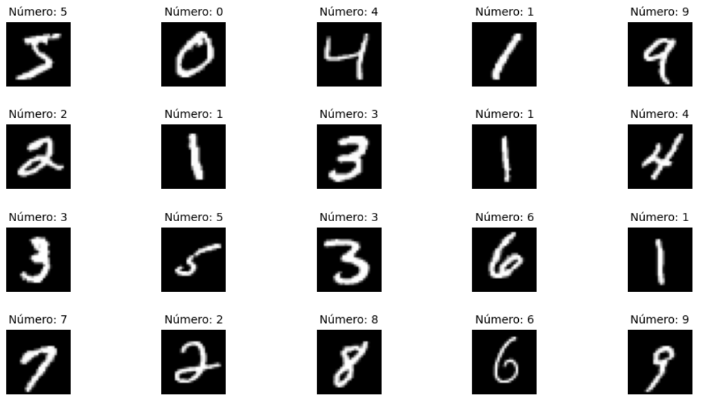
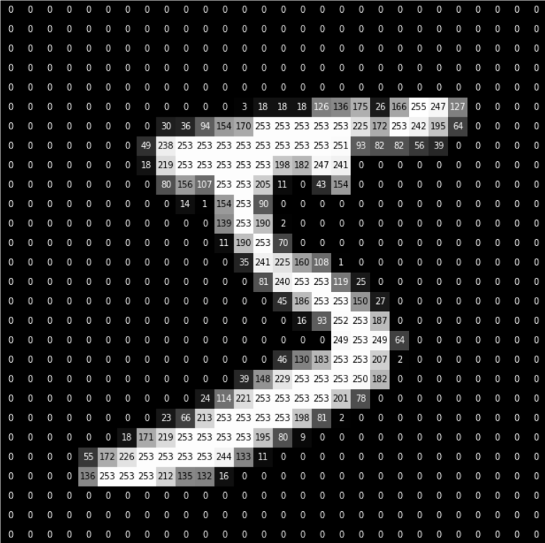
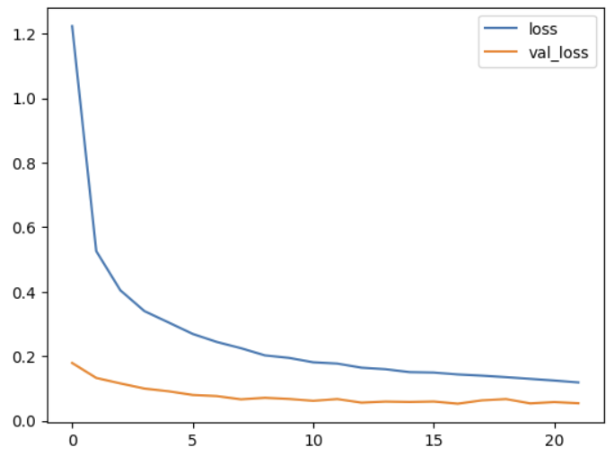
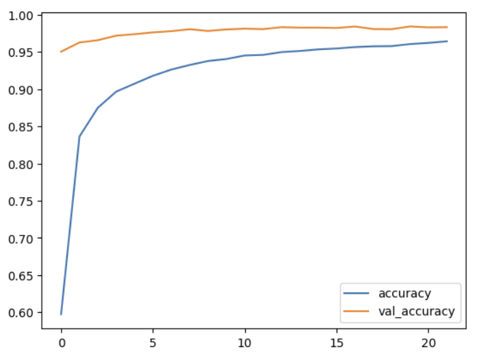
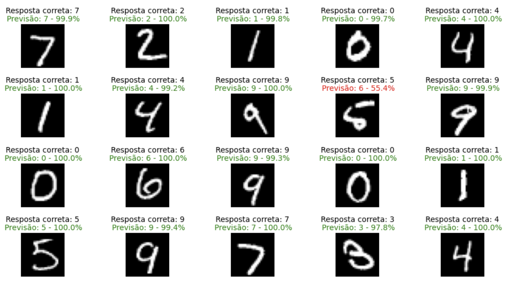
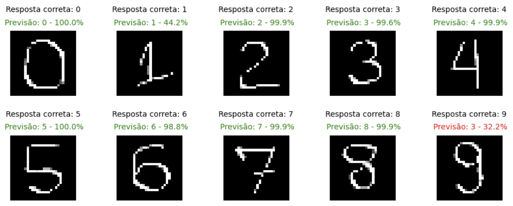

# Ciência de Dados - Projeto Final 9

## Projeto
**Modelo de deep learning** com visão computacional para reconhecimento de escrita em um aplicativo de transcrição de texto.

## Descrição
xxxxxxxxxxxxxxxxxxxxxxxxx Nesse projeto de Ciência de Dados, resumidamente, foi realizada uma ampla análise exploratória gerando os principais insights do projeto e permitindo identificar duas principais personas para os clientes de uma plataforma de delivery. 

Em seguida, foi criado um modelo de clusterização usando K-Means para identificar melhor as personas dos clientes e permitindo assim a empresa direcionar melhor a campanha de marketing para os clientes que tem a maior probabilidade de aceitá-la. 

Por fim, foi criado um modelo de classificação usando Regressão Logística para prever se os clientes devem ou não aceitar as futuras campanhas de marketing da empresa.                                                                                                 |

## Overview do dataset

## Detalhamento dos pixels da figura em escala de cinza

## Verificações de overfitting no modelo

## Previsões do dataset realizadas pelo modelo

## Previsões de número escritos à mão realizadas pelo modelo
