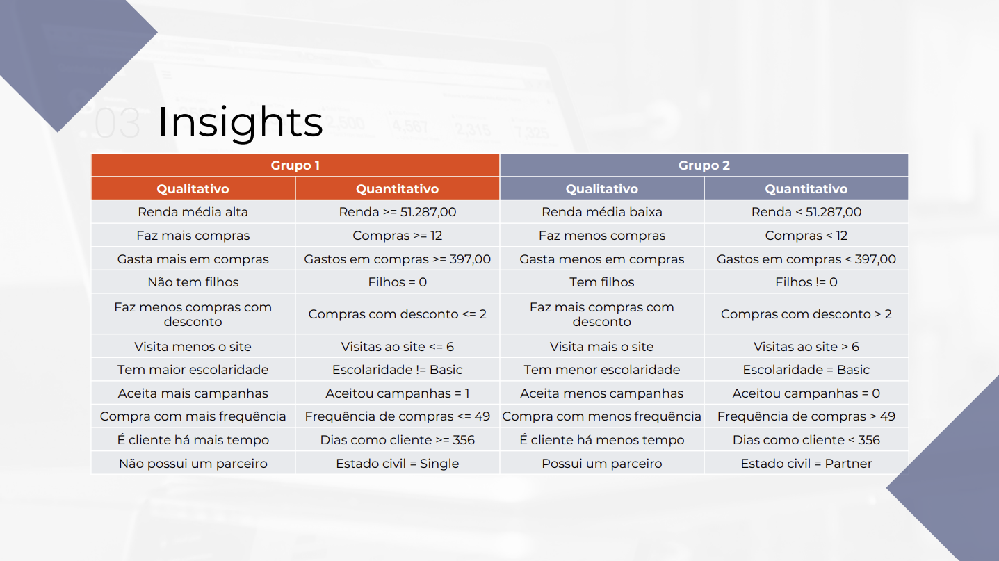
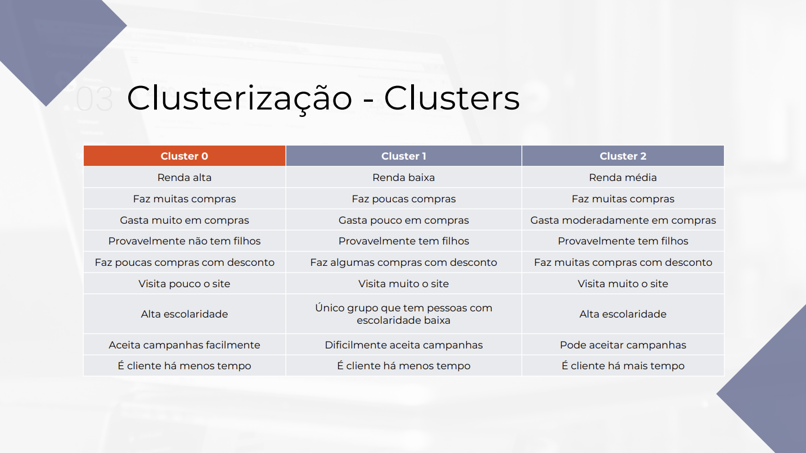
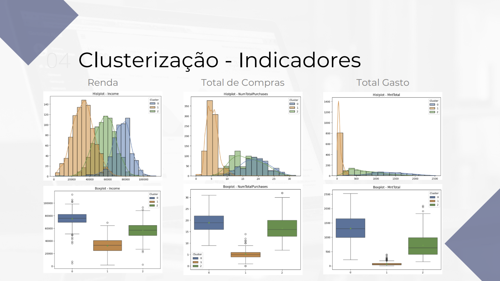
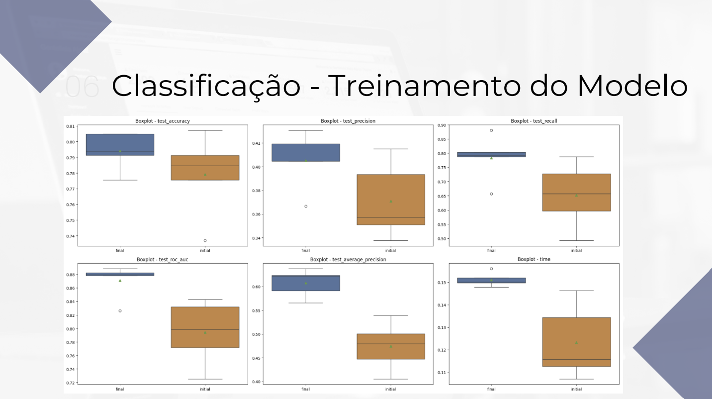
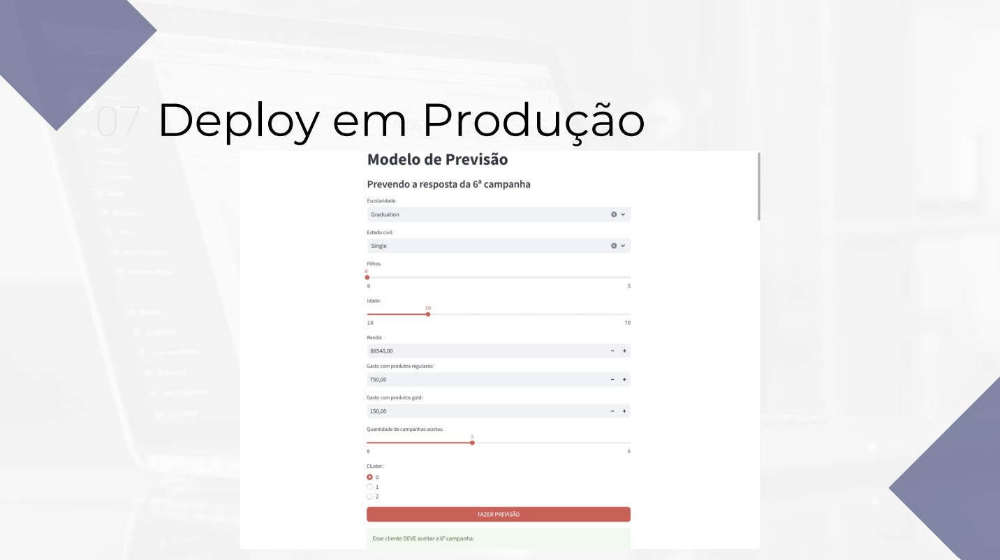

# Ciência de Dados - Projeto Final 9

## Projeto
**Modelo de deep learning** com visão computacional para reconhecimento de escrita em um aplicativo de transcrição de texto.

## Objetivo
O objetivo do projeto é, a partir dos dados de campanhas piloto, construir um **modelo de clusterização** para segmentação de clientes em campanhas de marketing em uma plataforma de delivery.  

A intenção é que o modelo preveja o comportamento dos consumidores e torne possível aplicá-lo a toda a base de clientes, permitindo que a empresa identifique os clientes que têm maior probabilidade de aceitar a campanha, otimizando assim os resultados das campanhas e tornando-as altamente lucrativas.  

E em seguida, construir um **modelo de classificação** de acordo com os resultados obtidos no modelo inicial para prever se os clientes devem ou não aceitar as futuras campanhas da empresa.

## Descrição
Nesse projeto de Ciência de Dados, resumidamente, foi realizada uma ampla análise exploratória gerando os principais insights do projeto e permitindo identificar duas principais personas para os clientes de uma plataforma de delivery. 

Em seguida, foi criado um modelo de clusterização usando K-Means para identificar melhor as personas dos clientes e permitindo assim a empresa direcionar melhor a campanha de marketing para os clientes que tem a maior probabilidade de aceitá-la. 

Por fim, foi criado um modelo de classificação usando Regressão Logística para prever se os clientes devem ou não aceitar as futuras campanhas de marketing da empresa.                                                                                                 |

## Referências
- **Repositório do desafio:** https://github.com/ifood/ifood-data-business-analyst-test

## Bibliotecas
- **Matplotlib:** https://matplotlib.org/
- **NumPy:** https://pandas.pydata.org/docs/index.html
- **Pandas:** https://pandas.pydata.org/docs/index.html
- **Scikit-Learn:** https://seaborn.pydata.org/
- **Seaborn:** https://seaborn.pydata.org/

## Estrutura do Projeto
- **.venv/:** Pasta destinada a armazenar o ambiente virtual do projeto se necessário
- **data/:** Pasta destinada a armazenar as versões dos datasets: raw, processed, lean, transformed, entre outros
- **deploys/:** Pasta destinada a armazenar os deploys do projeto, em formatos jupyter notebook, python, executável e streamlit
- **dictionaries/:** Pasta destinada a armazenar os dicionários do projeto: charts, data, datasets, evaluation metrics, feature engineering, models, pipeline e stats
- **docs/:** Pasta destinada a armazenar os arquivos e documentos referentes ao projeto
- **functions/:** Pasta destinada a armazenar arquivos com as funções do projeto: charts, libraries e stats
- **images/:** Pasta destinada a armazenar imagens do projeto: illustrations e outputs
- **models/:** Pasta destinada a armazenar os modelos criados durante o projeto
- **notebooks/:** Pasta destinada a armazenar os notebooks de cada etapa do projeto de ciência de dados
- **params/:** Pasta destinada a armazenar as constantes e variáveis globais do projeto
- **presentations/:** Pasta destinada a armazenar as apresentações do projeto, em PowerPoint e PDF
- **references/:** Pasta destinada a armazenar arquivos com informações do projeto, como markdown tables e cronograma
- **reports/:** Pasta destinada a armazenar relatórios criados durante o projeto
- `.env`: Arquivo para armazenar as variáveis de ambiente sensíveis do projeto, como usuários, senhas, tokens e chaves de API
- `.gitattributes`: Arquivo para configurar o repositório e omitir arquivos sem utilidades da versão final do projeto
- `.gitignore`: Arquivo para ignorar determinados arquivos ao subir o projeto para o Github
- `LICENSE`: Arquivo com a licença do projeto
- `README.md`: Arquivo para resumir e apresentar o projeto
- `requirements.txt`: Arquivo para listar as dependências/bibliotecas necessárias no projeto
- `to_do.txt`: Arquivo para anotar as tarefas pendentes do projeto

## Resultados - EDA

## Resultados - Clusterização

## Resultados - Classificação

